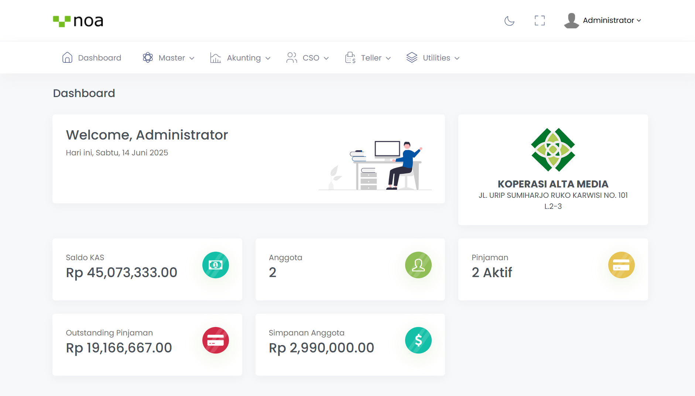

# Koperasi Simpan Pinjam

# 🏦 Aplikasi Koperasi Simpan Pinjam
Aplikasi ini dirancang untuk mengelola operasional koperasi simpan pinjam secara digital, mulai dari pendaftaran anggota, transaksi simpanan dan pinjaman, hingga pencatatan akuntansi. Aplikasi ini dikembangkan menggunakan **Laravel 12** dengan arsitektur **Repository Pattern** untuk mendukung pengelolaan operasional koperasi simpan pinjam secara modern, terstruktur, dan scalable. Fitur mencakup manajemen anggota, simpanan, pinjaman, akunting, hingga API untuk integrasi eksternal.

---

## 🚀 Teknologi yang Digunakan
- [Laravel 12](https://laravel.com/) - Backend & REST API  
- Repository Pattern - Struktur kode yang rapi & mudah dikembangkan  
- [MySQL](https://www.mysql.com/) - Database utama  
- [Bootstrap](https://getbootstrap.com/) + jQuery AJAX SPA - Tampilan UI interaktif  
- [Spatie Laravel Permission](https://spatie.be/docs/laravel-permission) - Role & Permission Management  
- [Scramble](https://scramble.dedoc.co/) - Tools dokumentasi API otomatis  

---

## 🌐 Live Demo

🔗 **Link Demo Aplikasi:** [http://libredigital.id](http://libredigital.id)  

**Administrator**  
- Email: `test@example.com`  
- Password: `password`  

**Anggota**  
- Email: `adi@mail.com`  
- Password: `password`  

📖 **Dokumentasi API**  
- URL: [http://libredigital.id/docs/api#/](http://libredigital.id/docs/api#/)  
- Dibangun menggunakan library **Scramble** untuk dokumentasi interaktif API.  

---

## 📌 Modul & Fitur Utama

### 🔹 Anggota
- Registrasi Anggota  
- Laporan Data Anggota  
- Login Anggota & Dashboard  
- Pengajuan Pinjaman & Simulasi Pinjaman  
- Laporan Mutasi Simpanan  
- Laporan Angsuran Pinjaman  

### 🔹 Master Data
- Data Simpanan  
- Data Pinjaman  
- Data Sandi Simpanan  
- Data Jaminan Pinjaman  

### 🔹 Simpanan
- Pembuatan Rekening Simpanan  
- Transaksi Setoran & Penarikan  
- Laporan Saldo Simpanan  
- Laporan Mutasi Rekening  

### 🔹 Pinjaman
- Pengajuan Pinjaman  
- Approval Pinjaman  
- Pencairan Pinjaman  
- Angsuran Pinjaman  
- Laporan Pengajuan Pinjaman  
- Laporan Pencairan Pinjaman  
- Laporan Angsuran Pinjaman  
- Laporan Riwayat Angsuran  

### 🔹 Akunting
- Master Chart of Account (CoA)  
- Transaksi Jurnal Kas & Memorial  
- Laporan Jurnal  
- Laporan Arus Kas  
- Laporan Buku Besar  
- Laporan Laba Rugi  
- Laporan Neraca  

### 🔹 Login Management
- Data User  
- Role & Permission Management (Spatie)  
- Login Operator  
- Login Anggota  

### 🔹 Utilitas
- Pengaturan Identitas Koperasi  
- Pengaturan Sistem  
- Tutup Periode Harian  

### 🔹 API Development
- API Data Anggota  
- API Data Simpanan  
- API Data Pinjaman  
- API Master Data  
- API Data Akunting  
- API Login  

---

## 📷 Tampilan Aplikasi

### 👤 Modul Anggota
-   
-   
-   
-   
-   
-   

### 💰 Transaksi & Simulasi
-   
-   
-   
-   
-   

### 📊 Laporan & Akunting
-   
-   
-   
-   
-   

